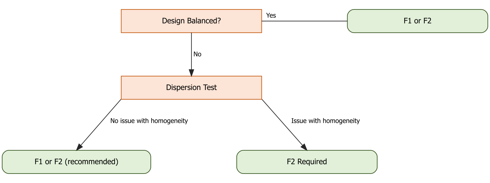
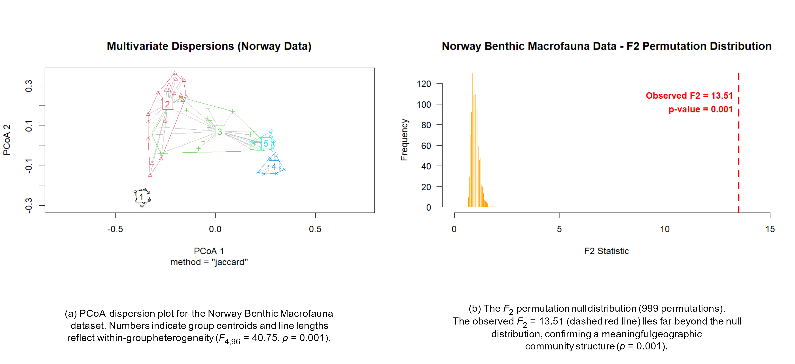
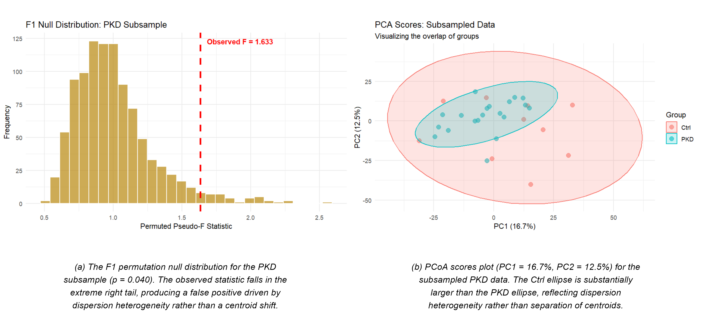

# Summary

In ecological studies, many different aspects of sites might be measured, such as the presence/absence of many different plant species, with the goal of comparing groups of sites based on a common characteristic or treatment that was assigned. In clinical metabolomics, liquid chromatography-mass spectrometry (LC-MS) studies generate datasets with thousands of chemical features measured in patient samples, where the number of variables, $P$, substantially exceeds the number of observations, $N$, so $P \gg N$. In both settings, the central inferential goal is comparing group centroids to determine whether overall composition differs using a test like the PERMANOVA procedure [@anderson2017some], but groups may differ in location as well as in variability, complicating inference.

Biological cohorts often differ in internal heterogeneity. A healthy control group may cluster tightly, while a disease cohort spanning varied progression of the disease may be more dispersed. This multivariate heteroskedasticity biases the standard PERMANOVA ($F_1$) p-value. Under an unbalanced design (with unequal group sample sizes), the pooled within-group denominator underweights the variance of the smaller, more dispersed group, inflating the $F_1$-ratio and producing inflated Type I error rates. This is called the multivariate Behrens-Fisher problem.

`F2Adonis2` implements a distance-based non-parametric framework resolving this problem [@anderson2017some]. Replacing $F_1$'s pooled denominator with a weighted combination of group-specific dispersion estimates isolates genuine centroid shifts from background dispersion differences. The package integrates with the `vegan` R package [@vegan2024], preserving identical formula syntax and workflow compatibility.

# Statement of need

The classical Behrens-Fisher problem tests location equality of the univariate means in $K$ groups ($k=1,...,K$) under unknown, unequal population variances [@welch1947generalization]. Classical multivariate inference extensions require non-singular covariance matrices, limiting their use in high-dimensional settings ($P \gg N$) where within-group covariances become singular. Distance-based alternatives like standard PERMANOVA ($F_1$) avoid this by operating on pairwise dissimilarities [@anderson2001new], but remain sensitive to pooling bias under unequal sample sizes and heterogeneous dispersions [@anderson2017some].

The standard PERMANOVA for a $K$ group test pools within-group variation via a size-weighted average:

$$F_1 = \frac{SS_A / (K-1)}{SS_W / (N-K)} = \frac{\text{tr}(HG) / (K-1)}{\text{tr}((I-H)G) / (N-K)},$$

where $G$ is the Gower-centered inner-product matrix derived from the dissimilarity matrix, and $H$ is the projection matrix that isolates among-group variation (both defined in the Software Design section below).

The $F_1$ denominator underestimates the numerator's true variance when a smaller group has high dispersion, contracting the permutation null distribution and inflating Type I error. `F2Adonis2`'s unpooled denominator accounts for group-specific dispersion, providing a valid test where a balanced design is not possible.

The target audience for the software includes researchers in clinical metabolomics, ecology, genomics, and any field generating high-dimensional multivariate data. Our interest was heightened when MetaboAnalyst [@metaboAnalystR] began using $F_1$ on all pairs of PCA scores for comparing known groups when pairs of the first few PCA scores were plotted. No existing R package provides an accessible, `vegan`-compatible $F_2$ implementation with integrated dispersion diagnostics and permutation visualization.

# State of the field

Parametric adjustments for the multivariate Behrens-Fisher problem, such as the Nel-van der Merwe [@nel1986solution] or Krishnamoorthy-Yu [@krishnamoorthy2004modified] extensions, require multivariate normality and non-singular covariances ($N > P$), making them inapplicable to high-dimensional 'omics and ecological data [@anderson2017some]. The non-parametric implementation in adonis2 in vegan [@vegan2024] is a standard tool researchers use across ecology and 'omics to test whether group centroids differ, yet lacks an unpooled denominator for unequal sample sizes under heteroskedasticity. While researchers can assess dispersion homogeneity using `betadisper` and `permutest` in vegan [@vegan2024], diagnosing heterogeneity does not resolve PERMANOVA's resulting pooling bias.

`F2Adonis2` fills this gap as a plug-in extension, retaining the distance-based sum of squares from Gower centering [@gower1966some], but modifying the denominator to use separate variance estimates for each group, similar to the univariate Brown-Forsythe test [@brown1974robust]. Unlike `adonis2`, which pools variance across groups, `F2Adonis2` calculates a separate variance estimate per group, making the test valid under unequal group variances. Additionally, a built-in plotting function visualizes the observed statistic against its permutation null distribution.

Based on our simulations and Anderson et al. [-@anderson2017some], we recommend the workflow as illustrated in \autoref{fig:pathway_diagram}, where most concern for $F_1$ is with unbalanced designs with clear (detectable) dispersion differences.

{ width=85% }

# Software design

$F_2$ was implemented as a replacement for `vegan::adonis2` rather than a standalone tool, easing adoption for existing `vegan` users, though it requires storing the full distance matrix in memory. This is not a practical concern for typical clinical and ecological sample sizes.

`F2_adonis2()` mirrors `vegan::adonis2`'s formula syntax. The decomposition proceeds as follows:

1. **Dissimilarity Construction**: An $N \times N$ symmetric dissimilarity matrix $D$ is constructed using a user-specified metric (e.g., Euclidean, Jaccard, or Bray-Curtis).
2. **Gower Centering**: $D$ is transformed into an inner-product matrix $G = \Delta A \Delta$, where $a_{kj,k'j'} = -\frac{1}{2}d_{kj,k'j'}^2$ and $\Delta = I_N - \frac{1}{N}J_N$ [@gower1966some], where $J_N$ denotes an $N \times N$ matrix of ones and $I_N$ denotes the $N \times N$ identity matrix.
3. **Partition Projection**: The hat matrix $H = \text{diag}[\frac{1}{n_1}J_{n_1}, \ldots, \frac{1}{n_K}J_{n_K}] - \frac{1}{N}J_N$ isolates the among-group component.
4. **Denominator Unpooling**: Group-specific dispersion estimates $V_k$ are calculated exclusively from within-group pairwise distances [@anderson2017some]:

$$V_k = \frac{1}{n_k(n_k-1)} \sum_{j=1}^{n_k-1} \sum_{j'=j+1}^{n_k} d_{kj,kj'}^2$$

5. **Modified $F_2$ Ratio**: group-size weights $(1 - n_k/N)$ ensure $\mathbb{E}[F_2] \approx 1$ under the null hypothesis regardless of whether group covariances are equal [@anderson2017some]:

$$F_2 = \frac{\text{tr}(HG)}{\displaystyle\sum_{k=1}^{K}\!\left(1-\frac{n_k}{N}\right)V_k}$$

In each permutation $\pi$, recomputing $V_k^{(\pi)}$ from shuffled labels ensures the denominator adjusts dynamically, which simulations suggest maintains nominal Type I error rates across tested scenarios. The package also offers bias adjustment (`bias.adjust = TRUE`) and bootstrap resampling (`bootstrap = TRUE`) following Anderson et al. [-@anderson2017some]. Permutation is the recommended default, since Anderson et al. [-@anderson2017some] show it achieves better Type I error control and equal or greater power than the bootstrap across tested scenarios. On our package's PKD dataset (999 permutations), $F_2$ completed in approximately 20 times the runtime of standard PERMANOVA, reflecting its additional group-specific computations.

# Research impact statement

By replacing $F_1$'s pooled denominator, `F2Adonis2` enables safer inference under heterogeneous dispersion, avoiding falsely detected centroid differences. The evaluations below provide evidence of this benefit and a foundation for future innovations related to $F_2$.

## High-Dimensional Block Correlation Simulation

Performance was evaluated using a block correlation design ($P = 10{,}000$, two blocks of 5,000, intra-block correlation $r = 0.3$) with $B = 1{,}000$ replications and 999 permutations at $\alpha = 0.05$. All groups share a zero mean vector under the null, and the only difference is dispersion (\autoref{tbl:simulation}).

Each group $k$ was simulated as $\text{MVN}(\mathbf{0}, V_k)$, with $V_k = c_k R$, where $R$ is the shared baseline block-correlation matrix and $c_k$ are group-specific scaling constants. At nominal $\alpha = 0.05$, $F_1$ showed severe Type I error inflation under sample imbalance and heterogeneous dispersions. Error rates reached 34.50% in Scenario A (Reverse Bias: $n = (3, 7, 20)$; $(c_1,c_2,c_3) = (2.0, 1.5, 1.0)$) and 20.10% in Scenario B ($(c_1,c_2,c_3) = (1.5, 2.0, 1.0)$). In contrast, $F_2$ controlled Type I error rates at 4.90% and 4.20%, closely matching the $\alpha = 0.05$ target.

This indicates the Behrens-Fisher problem in PERMANOVA arises primarily from the combination of unbalanced group sizes and heterogeneous dispersions. Even modest imbalance with unequal dispersions can produce severe Type I error inflation, highlighting the need for $F_2$ as the default in real-world multivariate studies. In Scenario C (Balanced: $n=(7,7,7)$; $(c_1,c_2,c_3)=(2.0,1.5,1.0)$), both methods were near the target ($F_1$: 5.10%, $F_2$: 4.90%), suggesting that balanced designs may mitigate the issue, but not eliminate statistical artifacts of heteroskedasticity. Additional simulation studies in Anderson et al. [-@anderson2017some] support this pattern of results.

| Scenario | Group Sizes | $F_1$ Rate | $F_2$ Rate | Target |
|:---|:---|:---:|:---:|:---:|
| A: Reverse Bias | $n=(3,7,20)$ | 34.50% | 4.90% | 5.00% |
| B: Mixed Heterogeneity | $n=(3,7,20)$ | 20.10% | 4.20% | 5.00% |
| C: Balanced | $n=(7,7,7)$ | 5.10% | 4.90% | 5.00% |

: Type I Error Rates under High-Dimensional Block Correlation ($P = 10{,}000$, $\alpha = 0.05$).\label{tbl:simulation}

## Environmental Baseline Validation

The Norway Benthic Macrofauna dataset [@gray2002analysis] records presence-absence data for $P = 809$ species across $N = 101$ sites near the Ekofisk oil field, grouped into $K = 5$ geographic areas with roughly balanced group sizes ($n = 16$--$25$), using Jaccard dissimilarity. This example is discussed in Anderson et al. [-@anderson2017some]. This tests $F_2$ in a near-balanced setting with heterogeneous dispersions, where genuine location differences may exist.

`vegan::betadisper` showed strong heterogeneity ($F_{4,96} = 40.75$, $p = 0.001$). $F_1$ and $F_2$ nonetheless gave similar conclusions ($F_1 = 12.89$, $F_2 = 13.51$; both $p = 0.001$; \autoref{tbl:norway}), showing the modification loses no power to detect location differences here. This result supports $F_2$ as a safe default, agreeing with $F_1$ in a near-balanced design (\autoref{fig:norway_plots}).

| Method | Statistic | $p$-value |
|:---|:---:|:---:|
| Standard PERMANOVA ($F_1$) | 12.886 | 0.001 |
| Modified PERMANOVA ($F_2$) | 13.510 | 0.001 |

: Results on the Norway Benthic Macrofauna baseline dataset (Jaccard dissimilarity, 999 permutations).\label{tbl:norway}

{ width=85% }

## Clinical Application: Early-Stage PKD Metabolomics

A controlled subsample ($n_{\text{Ctrl}} = 10$, $n_{\text{PKD}} = 20$) was drawn from a high-dimensional LC-MS urinary metabolomics dataset from early-stage autosomal dominant polycystic kidney disease patients [@houske2023urinary], provided in the package. This 1:2 imbalance reflects rare-disease studies, where recruiting affected participants is often easier than matching an equal number of controls, who may still be biologically heterogeneous.

Homogeneity testing confirmed strong dispersion heterogeneity ($p = 0.017$). Standard PERMANOVA incorrectly detected a meaningful location shift ($F_1 = 1.63$, $p = 0.040$), while $F_2$ identified the result as having much less evidence against the null hypothesis ($F_2 = 1.41$, $p = 0.079$) once dispersion was accounted for. The truth is not known here but the differences in possible inferences coming from $F_1$ and $F_2$ are highlighted in \autoref{tbl:pkd} and visualized in \autoref{fig:pkd_plots}.

| Method | Statistic | $p$-value |
|:---|:---:|:---:|
| Standard PERMANOVA ($F_1$) | $F_1 = 1.63$ | 0.040 |
| Modified PERMANOVA ($F_2$) | $F_2 = 1.41$ | 0.079 |

: Inference results on the subsampled PKD dataset (10 Ctrl, 20 PKD; Euclidean distance; 999 permutations).\label{tbl:pkd}

This was corroborated by component-level decomposition. Welch's $t$-tests on the top five principal components showed weak evidence of group differences on any axis (PC1: $p=0.164$; PC2: $p=0.204$; PC3: $p=0.292$; PC4: $p=0.704$; PC5: $p=0.345$), and pairwise $F_2$ sensitivity analyses on all ten two-dimensional PC planes provided similarly large p-values. None of these results were adjusted for multiple testing.

{ width=85% }

# AI usage disclosure

Generative artificial intelligence tools, specifically Gemini Pro (version 3.1) [@google2026gemini] and Claude Sonnet (version 4.6) [@anthropic2026claude], were selectively used to assist in debugging and refactoring package internals, configuring automated testing loops, drafting documentation metadata, and editing the manuscript. Core design decisions were made by the human authors, who manually verified all code via `devtools::check(cran = TRUE)`, and reviewed and edited all manuscript text.

# Acknowledgements

Computational efforts were performed on the Tempest High Performance Computing System, operated and supported by University Information Technology Research Cyberinfrastructure (RRID:SCR_026229) at Montana State University.

Greenwood was supported by the National Institute of Arthritis and Musculoskeletal and Skin Diseases of the National Institutes of Health under award number R01AR081489.

# References
